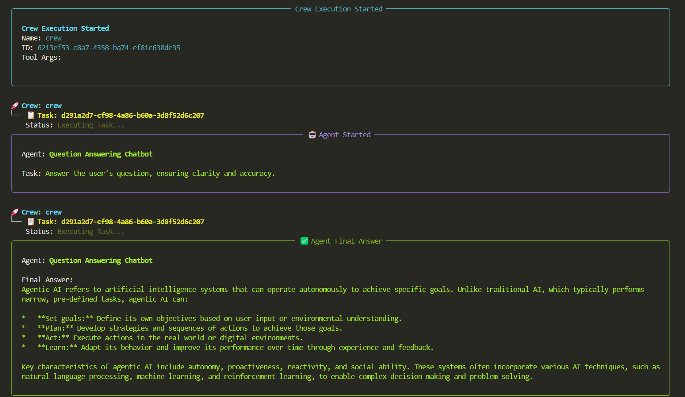
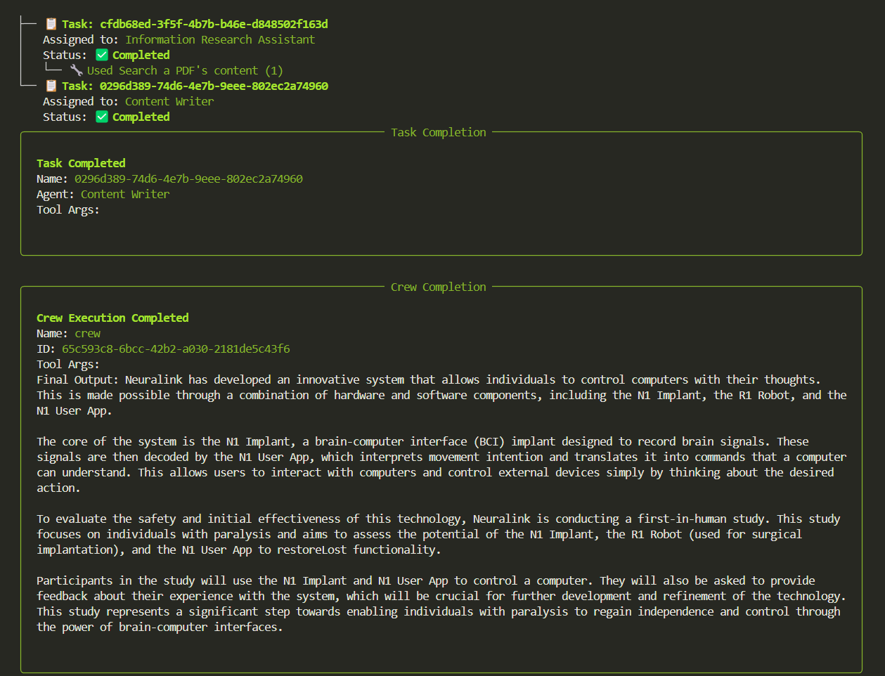
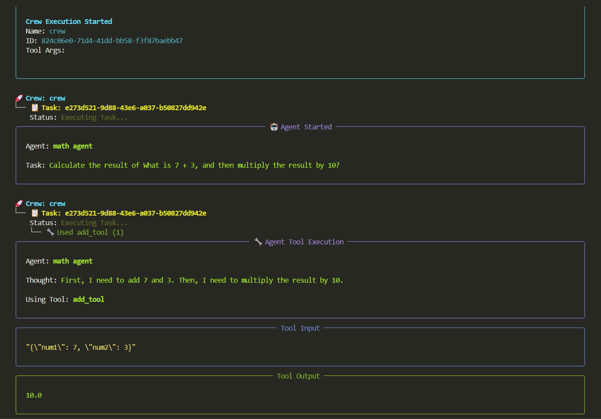

# CrewAI-Doc-Search-Tool

Build a workflow using CrewAI tools to scrape the content from the documents and then perform RAG on it. Star this repository if you find it valuable!

## Installation

We need to write the code that will make the tool work. Before we begin, let’s install the crewai-tools and crewai packages using pip `pip install crewai-tools crewai`. Make sure virtual environment is created and activated if you are using one. Refer [Virtual Environments](./ENV.md) for more details.

## Usage

### Stage 01 : Basic ChatBot Assistant

In this stage we will create a basic question-answering chatbot using CrewAI. The bot uses a LLM model to provide accurate and concise answers to user questions. This foundational stage establishes the core agent and task structure that will be expanded in later stages with web scraping and RAG capabilities.

Example code for this stage is available in the [stage1.py](./stage1.py) file and can be run using the command `python stage1.py`.

### Stage 02 : ChatBot with RAG

In this stage, we will enhance the chatbot by incorporating Retrieval-Augmented Generation (RAG) capabilities. This allows the bot to retrieve relevant information from documents and use it to generate more accurate and context-aware responses. A vector database is automatically created with chromadb to store the document embeddings, enabling efficient retrieval of relevant information.

Example code for this stage is available in the [stage2.py](./stage2.py) file and can be run using the command `python stage2.py`.

<!--  -->

### Stage 03 : Custom Tools with CrewAI

Here we create a custom tool that performs basic arithmetic operations like addition, subtraction, and multiplication. The tool is integrated into the CrewAI framework, allowing the agent to use it for calculations. This stage demonstrates how to create and use custom tools within CrewAI, enhancing the agent's capabilities beyond simple question answering.

Example code for this stage is available in the [stage3.py](./stage3.py) file and can be run using the command `python stage3.py`.

## Conclusion

This project showcases the capabilities of CrewAI in building intelligent agents that can perform complex tasks such as document retrieval, question answering, and custom tool integration. Each stage builds upon the previous one, demonstrating the flexibility and power of the CrewAI framework for creating advanced AI applications.
